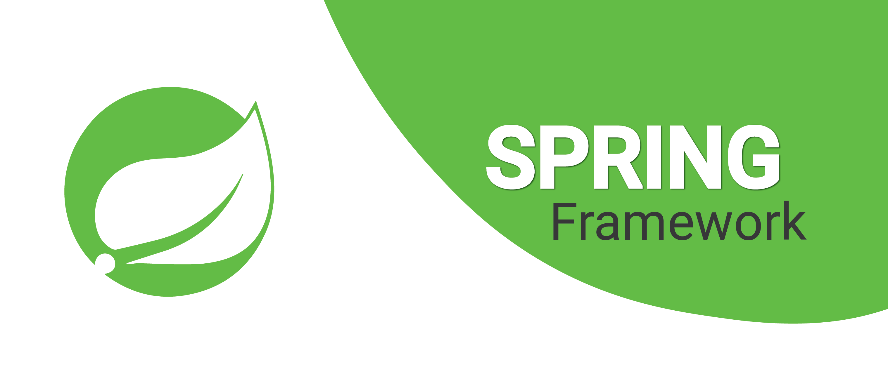
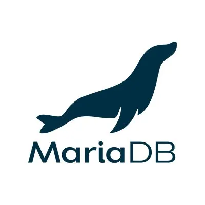

<h1 align="center">Mekylei Belchior</h1>

  Backend Developer • Java • Spring Boot

  I build practical software solutions with a focus on backend systems and database-driven applications.

  
  
  

---

## About Me

- Backend-oriented developer with experience in Java and Spring
- Experience working with relational databases such as Postgresql
- Interested in building clean, maintainable code and delivering software that creates real value

---

## Tech Stack

  
  
  
  
  
  
  
  
  
  
  
  
  
  
  
  

---

## GitHub Stats

  
  

---

## Highlights

- Java and Spring for backend development
- SQL databases and data modeling
- Git-based workflow and development tools
- Continuous learning and practical project building

---

  Feel free to explore, star, or fork any repository you find useful.

  

